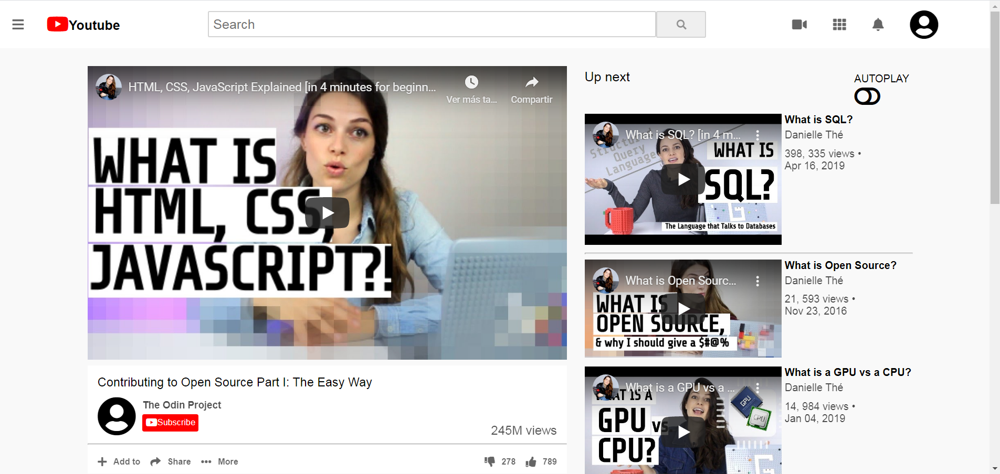

# home-page

First project for HTML/CSS section. Embedding videos.

Build with:
- HTML/CSS

 

Live Demo:
- https://deikdesign.github.io/home-page/.

Setup:
- To clone from terminal.
  - $ cd "folder location"
  - $ git clone https://github.com/deikdesign/home-page

Run tests:
- HTML validator, w3 validation

Authors:
=======

Live Demo
https://deikdesign.github.io/home-page/.

Prerequisites
Chrome browser
Setup
n/a
Install
n/a
Usage
n/a
Run tests
HTML validator, w3 validation
Deployment

👤 Deyan Todorov

Github: @deikdesign
Twitter: @deikdesign
Linkedin: linkedin

👤 Alan Soto

Github: @AlanSoto31
Twitter: @Alan95081574
Linkedin: linkedin
